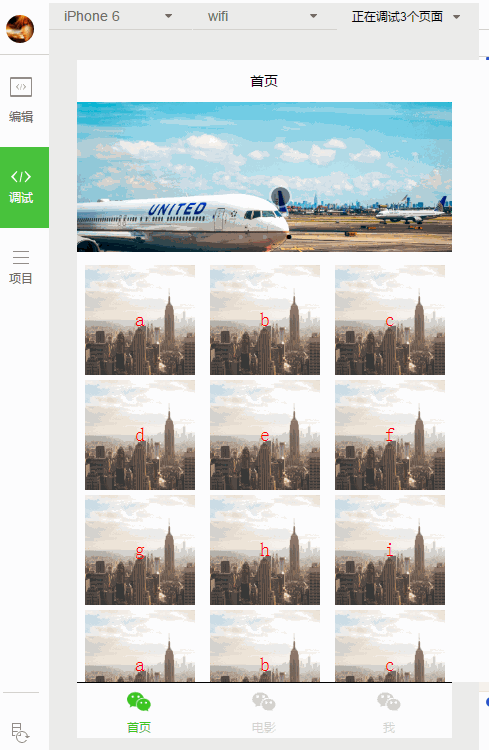

# wxapp

微信小程序学习

## 官方
[官方教程](https://mp.weixin.qq.com/wiki?t=resource/res_main&id=mp1474632113_xQVCl&token=&lang=zh_CN)

1. [小程序开发文档](https://mp.weixin.qq.com/debug/wxadoc/dev/index.html)
2. [小程序设计指南](https://mp.weixin.qq.com/debug/wxadoc/design/index.html)
3. [小程序开发者工具](https://mp.weixin.qq.com/debug/wxadoc/dev/devtools/download.html)

## demo演示

##其他

- [ide](https://github.com/gavinkwoe/weapp-ide-crack)

- [文档](http://wxopen.notedown.cn)
